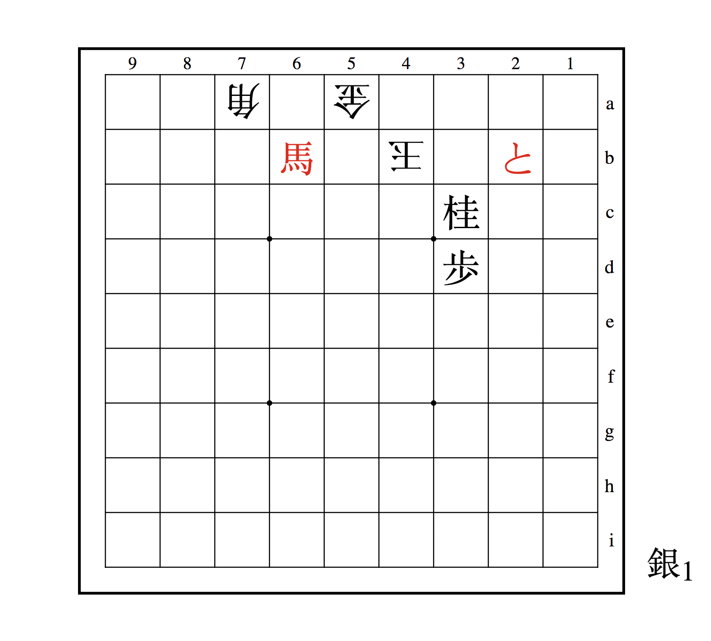

ogi Board
Simple and minimalistic shogi board. Main purpose is to share tsume and assist a bit during solving.

## Usage
Example: https://astrologer.github.io/shogi?sfen=9.9.9.1S1+R5.1P+r6.p1k6.1L1n5.3Gs4.+p2s5&title=ts5

Two parameters are supported currently:
 - sfen - sfen string that represents pieces on the board. Additional mappings are supported to avoid url encoding.
    - "/" <=> "." raw delimiter
    - " " <=> "_" section delimiter
    - "+" <=> "x" promotion flag
 - title - url encoded title of the window or
    - ts1 - "1 move tsume"
    - ts3 - "3 moves tsume"
    - ts5 - "5 moves tsume"
    - ts7 - "7 moves tsume"
    - ts9 - "9 moves tsume"
